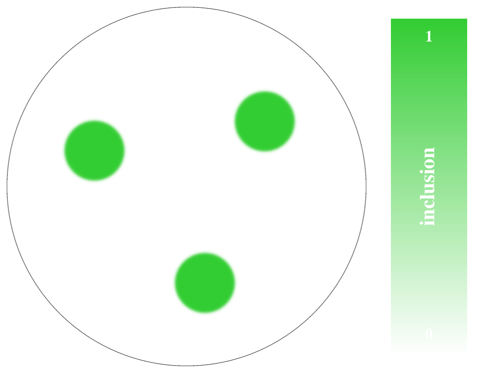
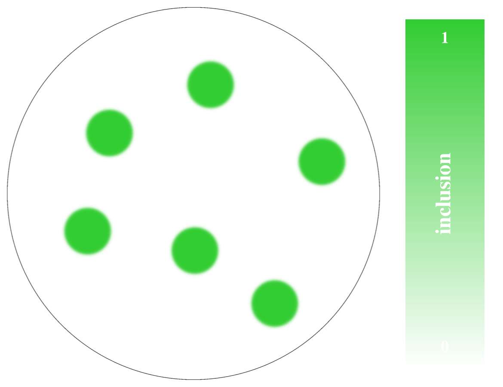
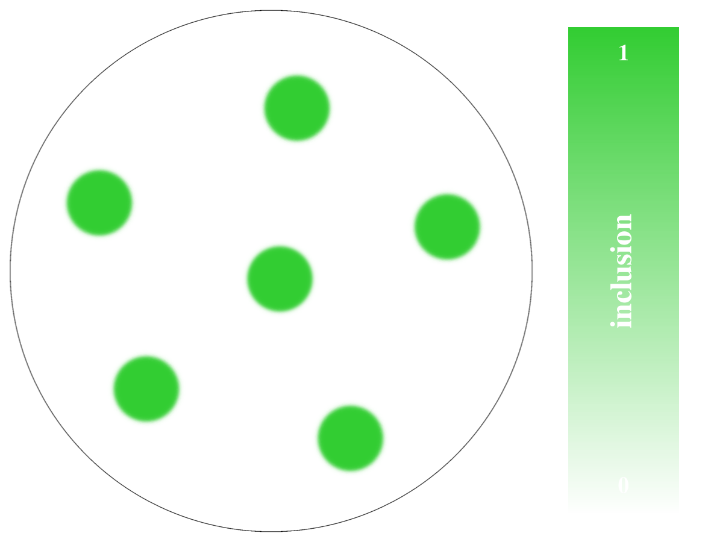
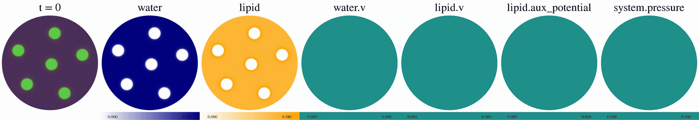
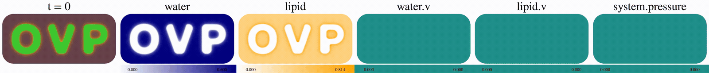
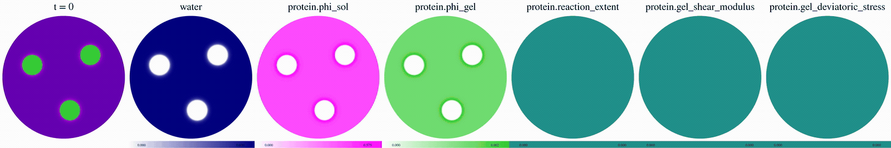
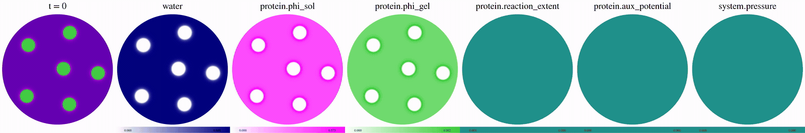
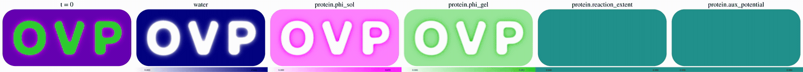

# OVPSolver

This is a mixed-(primarily, discontinuous Galerkin) finite element solver implemented on top of [FEniCS](https://fenicsproject.org/) for phase-field systems which can be described by an [Onsager variational principle](https://doi.org/10.1088/0953-8984/23/28/284118). An arbitrary number of phases are supported with saturation enforced [by pressure](https://link.aps.org/doi/10.1103/PhysRevE.55.R3844). Complex geometries with per-phase wetting are achieved by the [diffuse domain method](https://pmc.ncbi.nlm.nih.gov/articles/PMC3097555/).

It also supports, in Lie-split fashion, an arbitrary irreversible (i.e. non-OVP, non-energetically accounted for) dynamics interleaved with the OVP step. This step can be used, for example, to advance chemical reactions as we do in the polymerization example below.

These hand-written docs are supplemented by a separate (also hand-written) [CLAUDE.md](CLAUDE.md), at which an instance of `claude` can be pointed to inquire about and extend the codebase. Beyond changing parameters of the examples presented below, this is the recommended way of using the source.

## Installation

Best to use a fresh conda environment. An [environment file](environment.yml) is provided.

```bash
conda env create -f environment.yml
conda activate ovpsolver
# If on macOS, it is recommended to use Apple Accelerate BLAS. Wall time ~0.5x on the examples below.
if [[ "$(uname)" == Darwin ]]; then 
  conda env update -f environment.macos.yml
fi
pip install -ve .
```


## Usage

### Entrypoints

The entrypoints to the package are via each `PhaseFieldSystem`. This package includes `ModelB` and `PolymerizingB`, while user-defined extensions (as documented in [CLAUDE.md](CLAUDE.md)) inherit the same entrypoints and can add their own. 

```bash
python -m ovpsolver.model_b
usage: python -m ovpsolver.model_b [-h]
                                   run | analyze.conservation | analyze.drag_floor | analyze.emptying | analyze.fields | analyze.gelation | analyze.mesh_correlation | analyze.moments |
                                   analyze.positivity | analyze.roundtrip | analyze.saturation | analyze.stats | analyze.surface_leakage | analyze.wetting | visualize.domain |
                                   visualize.gelation | visualize.phases | visualize.phases_movie ...
```

We'll use `ovpsolver.SYSTEM` as a generic placeholder (the other system provided is `ovpsolver.polymerizing_b`).

### Defining geometry

One declares a `geometry.py` file like [this](examples/geometry_disks_triplet.py) which defines two top-level functions:

```python
def outer_domain(rng_seed: int) -> OuterDomain:
  # This object is basically callable that performs gmsh operations.
  pass

def signed_distance_functions(rng_seed: int, x: ufl.SpatialCoordinate, eps: float) -> list[ufl.Expr]:
  # Construct, as functions of x, analytical signed distance functions, one for each connected component of the domain.
  # `eps` is provided here merely to inform the construction of the objects, such as enforcing a minimum spacing. The SDF itself is unaware of eps.
  pass
```

You can visualize the domain before running the spec using the entrypoint `visualize.domain`.

```bash
python -m ovpsolver.SYSTEM visualize.domain spec.yaml
```

In the [crystalline](examples/geometry_disks_triplet.py) and [gaseous](examples/geometry_disks_gas.py) at $\beta=10, 100$ examples, these produce respectively:

<div align="center" style="text-align: center"> 
  
  
  
</div>

(The colorbar shows the indicator function of the complement of the domain to be solved, which we call "inclusions." These are rendered the same way in the following composite plots.) 

We also support basic signed-distance function conversion from CAD (via STEP) files, [ovp.step](examples/ovp.step). The corresponding [geometry_ovp.py](examples/geometry_ovp.py) file uses helpers from the library to declare the requisite geometry, which produces:

<div align="center" style="text-align: center">
  
</div>

(form compilation in general for such CAD conversions will take some time).

In this manner, the geometry can be quickly changed within the spec file with other parameters held fixed.

### Defining and running physics

Here the entrypoint in general is `run`:

```bash
python -m ovpsolver.model_b run examples/tips.yaml
```

All parameters for the run are contained within the spec, including the random seed. If the save path exists, the run will refuse, which you can override using `--overwrite`.

#### Thermally-induced phase separation

As per the above, using 

```bash
python -m ovpsolver.model_b run examples/tips.yaml
python -m ovpsolver.model_b visualize.phases_movie examples/scratch/tips/spec.yaml 0 100 --split --aux-fields water.v lipid.v lipid.aux_potential system.pressure 
```

with the latter displaying various saved scalar quantities as declared in [tips.yaml](examples/tips.yaml), we obtain:



Full: [tips_5.mp4](examples/tips_5.mp4)

Swapping out the geometry for [geometry_ovp.py](examples/geometry_ovp.py) and refining a little further, resulting in the lightly modified spec [tips_ovp.yaml](examples/tips_ovp.yaml), we obtain:



Full: [tips_ovp.mp4](examples/tips_ovp.mp4)

demonstrating wetting against surfaces with varying curvature and topology.

### Extending physics

Now we demonstrate the basic idea of altering the physical definition by changing the Rayleighian 

```math
\mathcal R = \dot E + \Psi
```

where $E$ is the free energy and $\Psi$ the (Rayleigh) dissipation potential. The Cahn-Hilliard equation with logarithmic potential, for example, is given by (up to saturation constraints, which we enforce via a pressure-like Lagrange multiplier)

```math
E = \sum_i\int_\Omega \Big[k_BT\Big(\frac{\phi_i}{N_i}\log\phi_i + \sum_{i \lt j} \chi_{ij} \phi_i\phi_j\Big) + \frac{\kappa_i}{2}|\nabla \phi_i|^2\Big]\,dx,\quad \Psi = \sum_i \int_\Omega \frac{|\phi_i v_i|^2}{2M_i(\phi_i)}\,dx,
```

where $v_i$ are the velocities (unknowns) of the solve and $\phi_i$ the phase-fields.

#### Polymerization-induced phase separation

In this example, we make the free-energy time-dependent through $N_i(t)$ and $\chi_{ij}(t)$ via an underlying polymerization reaction. This also leads to the formation of a separate gel phase, with each phase splitting into sol and gel as $\phi_i = \phi_i^{\rm s} + \phi_i^{\rm g}$.

The basic structure is to create a mini module which mirrors the structure of `PhaseFieldSystem` / `PhaseField` ([phase_field_system/](src/ovpsolver/phase_field_system)), as exemplified by `ModelB` ([model_b/](src/ovpsolver/model_b)). Documentation of key aspects of this abstract state tree (`PhaseFieldSystem` and `PhaseField`) along with user-facing constructions (`Transported`, `Flux`) can be found in 

- [The abstract structure](src/ovpsolver/phase_field_system/README.md): `PhaseFieldSystem`, `PhaseField`, `Transported` and `Flux`, and what they guarantee.
- [Model B](src/ovpsolver/model_b/README.md): what `ModelB` declares on top of it.
- [Polymerizing Model B](src/ovpsolver/polymerizing_b/README.md): what `PolymerizingB` adds.

Here, details of concrete implementations (`ModelB`, `PolymerizingB`) can be found within their respective submodules.

This system, which we call `PolymerizingB`, inherits directly from `PhaseFieldSystem` in [polymerizing_b/system.py](src/ovpsolver/polymerizing_b/system.py) and re-uses `ModelB`'s `CHPhaseField`s for non-polymerizing species, while defining a new `PolymerizingPhaseField` ([polymerizing_b/phase_field/field.py](src/ovpsolver/polymerizing_b/phase_field/field.py)) which extends the free energy $E$ and dissipation potential $\Psi$ definitions, while introducing separate velocities for separate sol and gel phases.

Thus, both `ModelB` and `PolymerizingB` are individually examples of defining new `PhaseFieldSystem`s, with the former simply declaring the free energy of mixing and the latter a more complex system with co-advected internal states representing, e.g. the extent of the polymerization reaction and state of strain of the gel phase.

As an implementation detail, the package provides first-class support for positivity-preserving transport of `DG0` fields, which as noted in [CLAUDE.md](CLAUDE.md) also make pointwise operations during an irreversible step (here, advancing reaction kinetics, which are not accounted at the level of the free energy rate) easy.

Lastly, one alters the parameters ([polymerizing_b/phase_field/parameters.py](src/ovpsolver/polymerizing_b/phase_field/parameters.py)), which then define the structure of the spec for this system. As noted above, the entrypoints are inherited for free, so one simply does 

```bash
python -m ovpsolver.polymerizing_b run examples/pips.yaml
```

from which we obtain (via now `python -m ovpsolver.polymerizing_b visualize.phases_movie examples/scratch/pips/spec.yaml 0 400` to extract the saved data):



Full: [pips.mp4](examples/pips.mp4)

This is a simple "crystalline" configuration of inclusions intended to demonstrate the formation of tessellation-like gelled structures in the bulk.

Similarly, for custom definitions outside the package, one simply builds:

```python
from ovpsolver.phase_field_system import PhaseFieldSystem

class MySystem(PhaseFieldSystem):
  ...

if __name__ == "__main__":
  MySystem.main()
```

with all entrypoints available automatically.

Then, as in TIPS above, we simply swap out to [geometry_disks_gas.py](examples/geometry_disks_gas.py) in [pips.yaml](examples/pips.yaml) to obtain the dynamics in a different geometry:



Full: [pips_5.mp4](examples/pips_5.mp4)

showing that the solid structures formed depend upon the configuration of surfaces. Finally an example of gelation templated by a complex surface:



Full: [pips_ovp.mp4](examples/pips_ovp.mp4)

Here gelled structures form at the wetting layer as above, but before structures can develop in the bulk a state invariant is violated at about t=0.078, which we discuss below. 

### Saving and resuming runs

The `save` declaration in the spec defines a directory to which all run data are written, fully self-contained, including a copy of the spec, geometry, and all output data. An existing run can therefore be resumed forward in time by:

```bash
python -m ovpsolver.SYSTEM run SAVE_DIR/spec.yaml --resume
```


### Analysis of runs

Various analysis tools are available to quantify features of runs and diagnose problems directly from the output data, in the [analyze/](src/ovpsolver/phase_field_system/analyze) submodule. These are generally executed by 

```bash
python -m ovpsolver.SYSTEM analyze.DIAGNOSTIC SAVE_DIR/spec.yaml
```

where `DIAGNOSTIC` is one of the modules in [analyze/](src/ovpsolver/phase_field_system/analyze), of which some notable ones are:

```
stats: Basic distributional summaries over time of all saved fields
conservation: Mass conservation of each phase
saturation: How well incompressibility is enforced
positivity: Positivity of phase-fields and other transported states
surface_leakage: How well flux conditions are enforced
wetting: How well wetting conditions are enforced
emptying: which fields and in what elements are leading to CFL-substepping 
```

## Other information

### Known issues and other caveats

#### Diffuse-domain boundary conditions

The diffuse-domain boundary conditions, in particular flux and wetting conditions, are enforced by distributed Lagrange multipliers. They can imprint mesh-dependent artifacts, which are often amplified by spinodal decomposition, depending on carefully tuned settings of the following parameters:

```yaml
solver:
  ...
  diffuse_domain:
    ...
    mesh_h: 0.01 # Mesh characteristic length, over the whole domain.
    domain_eps: 0.03 # Interface width 2 * eps, indicating six elements across the interface here.
    min_elements_across_interface_width: 5 # Minimum number of elements across the interface width before refinement occurs.
    indicator_quadrature_degree: 3 # Quadrature degree for integrals against the diffuse domain measure.
    indicator_floor: 0.05 # Floor for the diffuse domain measure.
```

Let us note also that, less sensitively, the enforcement of flux conditions varies with the following physical parameter:

```yaml
solver:
  ...
  diffuse_domain:
    ...
    surface_permeability: 1.0e-5
```

We use a stabilized Lagrange multiplier formulation which can be shown to be equivalent to a penalty-relaxation of the strict condition. The inverse of this penalty is the `surface_permeability` above (and in the case of pressure/saturation, the behavior is exactly analogous, governed by `dilatational_viscosity: 1.0e+5`.)

#### Mesh scaling: positivity preservation

The scheme (as described in [CLAUDE.md](CLAUDE.md)) uses upwinded transport in combination with a CFL condition to ensure positivity of those fields which declare it (e.g. phase-fields). We implement a retry/backoff scheme whereby the sub-timestep is progressively reduced in accordance with the CFL bound, when a step fails.

This in general proceeds without issue, but on extremely coarse meshes and other parameter settings (e.g. small `kappa`) can lead to vanishingly small timesteps. In this case, refinement while keeping the ratio of `h/eps` roughly fixed as seen going from [tips.yaml](examples/tips.yaml) to [tips_ovp.yaml](examples/tips_ovp.yaml) can help.

#### Mesh scaling: memory usage

Refinement, however, leads to superlinear memory usage, which for systems with more phases or larger state-spaces e.g. [pips.yaml](examples/pips.yaml) can easily exceed available memory, in which case thrashing will lead to extremely slow runtimes.

We mitigate this to some extent by splitting the problem naturally along the physical delineation, using the nomenclature:

```
"static": the rates -- pressure, velocities, bulk and surface Lagrange multipliers
"state": phase-fields and other transported states which the free energy reads live
```

(States which the free energy reads only lagged are not part of this solve at all: each is advanced afterwards, cell by cell.)

This fieldsplit is identified within the solver (along with user-defined extensions, which are declared at the type-level as `StaticElement`s, e.g. `VelocityElement`s, or as `StateElement`s) and passed along to PETSc under these names (`fieldsplit_static_*`, `fieldsplit_state_*`).

The static block is symmetric (though indefinite, due to Lagrange multipliers): its rows are precisely the stationarity condition $\delta \mathcal{R} / \delta(\text{rates}) = 0$, so its Jacobian is the Hessian of $\mathcal R$. The state block is instead the Jacobian of the corresponding transport rules, which is not symmetric (it is triangular, with diagonal blocks). Thus, we use a field-split preconditioner, with Cholesky factorization for the former and a standard LU factorization for the latter.

The two approaches, the monolithic direct LU solve, and the fieldsplit approach, can be toggled easily from the options passed to PETSc (e.g. in [tips.yaml](examples/tips.yaml)):

```yaml
solver:
  ...
  ovp_step:
    ...
    petsc_options:
      ...
      # # Direct monolithic approach
      # ksp_type: preonly
      # pc_type: lu
      # pc_factor_mat_solver_type: mumps
      # snes_lag_jacobian: 2
      # snes_lag_preconditioner: 2
      # Fieldsplit approach
      ksp_type: preonly
      pc_type: fieldsplit
      pc_fieldsplit_type: schur
      pc_fieldsplit_schur_fact_type: full
      pc_fieldsplit_schur_precondition: a11
      fieldsplit_state_ksp_type: preonly
      fieldsplit_state_pc_type: lu
      fieldsplit_state_pc_factor_mat_solver_type: petsc
      fieldsplit_static_ksp_type: gmres
      fieldsplit_static_ksp_pc_side: right
      fieldsplit_static_ksp_gmres_restart: 50
      fieldsplit_static_ksp_rtol: 1.0e-8
      fieldsplit_static_ksp_max_it: 500
      fieldsplit_static_pc_type: cholesky
      fieldsplit_static_pc_factor_mat_solver_type: mumps
      snes_lag_jacobian: 1
      snes_lag_preconditioner: 100
```

Jacobian lagging is used in the first case, as strong Newton convergence is typically observed in the direct solve. In the latter, we lag only the preconditioner as many inner iterations ($O(100)$ in general for these configurations) will be taken.

The second approach drastically reduces memory usage and is also competitive with the former in time. Further optimizations to reduce memory usage, e.g. nested field-splitting of individual velocities, are both welcome and forthcoming.

#### Spec migrations

In general, there is no migration mechanism for specs generated and used by older versions of the package. This is partially by design, as the self-generating nature of spec definitions means that there is no global definition to begin with.

Generally, however, a saved run's metadata can easily be modified by hand to be read by new versions of the code. Otherwise, the best approach is to use the version of the code that wrote the run: its `meta.json` records the commit hash under `code`, along with whether there were uncommitted changes and a digest of the source (so that `--resume` can report whether the code has changed).

#### Parallelism

Currently, the code does not apply the necessary precautions needed to enable correctly synchronized state across multiple MPI ranks. This is not an inherent limitation, but the primary usecase is aimed at workstations rather than HPC at the moment. PRs fixing this globally and abstractly are welcome. The OVP step dominates runtime, and shared-memory, threaded parallelism is fully leverage(able) both in the linear solves underlying the OVP step and in the irreversible step, in which most operations are generally trivially DOF-wise (thus enabling C++ kernels and OpenMP use therein as we do in [the polymerization kinetics](src/burgers.cpp)). 

#### Polymerizing-B: singular gradients

Runs of `PolymerizingB` typically fail at some point in the solve (unlike `ModelB`, which can generally be continued forever) due to the formation of very large, mesh-scale gradients in the phase field. This is currently understood to be a consequence of the fact that gel has no diffusive motion. While positivity of the transported fields is assured, invariants of the polymerization state are checked carefully and typically broken at this point. Fixes are in the works.

### Roadmap

1. Examples in one and three dimensions
2. Further memory optimizations to enable the latter
3. (Much further along) Moveable, deformable diffuse domains. This requires to some degree a theoretical reformulation of the DDM approach; the problem, other than differentiating through arbitrary parameterized signed-distance functions, is that the OVP step fundamentally loses joint convexity in the variables and degrades to biconvexity. A promising approach is to reformulate inclusions as phase-fields, making the structure additive rather than multiplicative, with the remaining difficulties pertaining to enforcement of the flux and wetting boundary conditions. Capturing simultaneously wetting and deformation is a next goal as it facilitates elastocapillarity.

